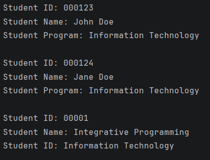
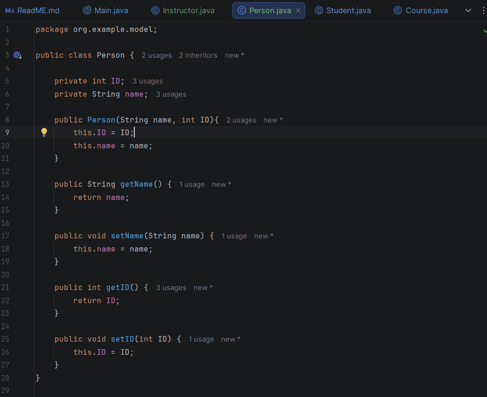
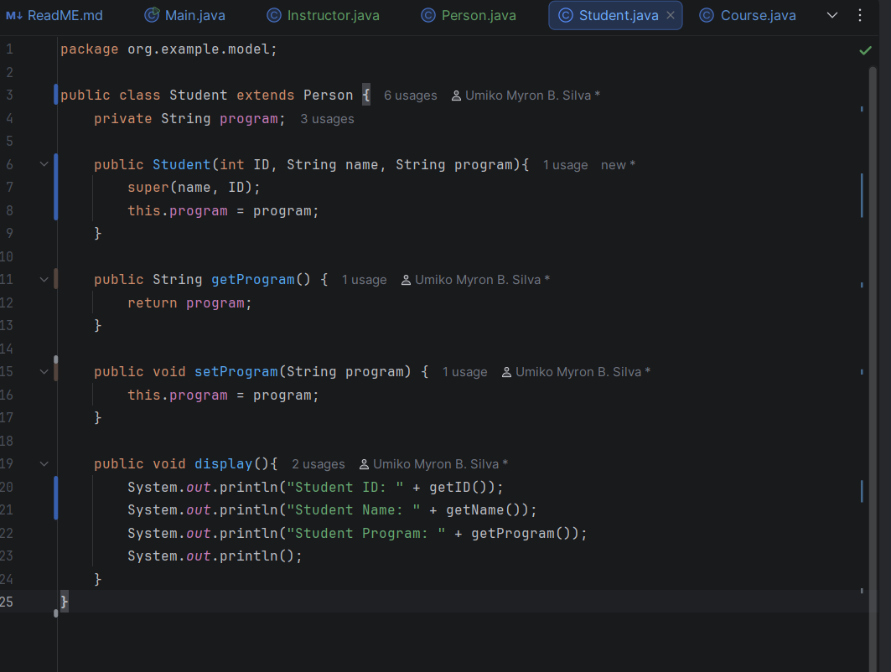
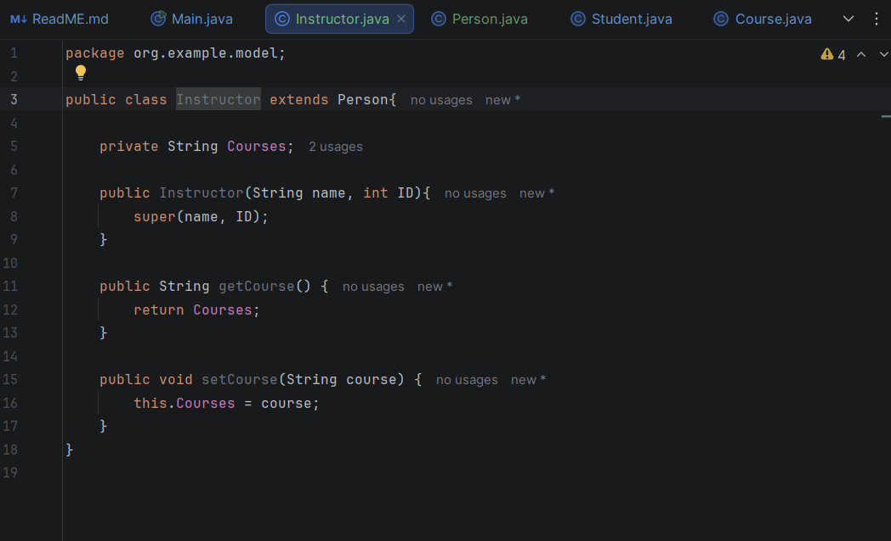
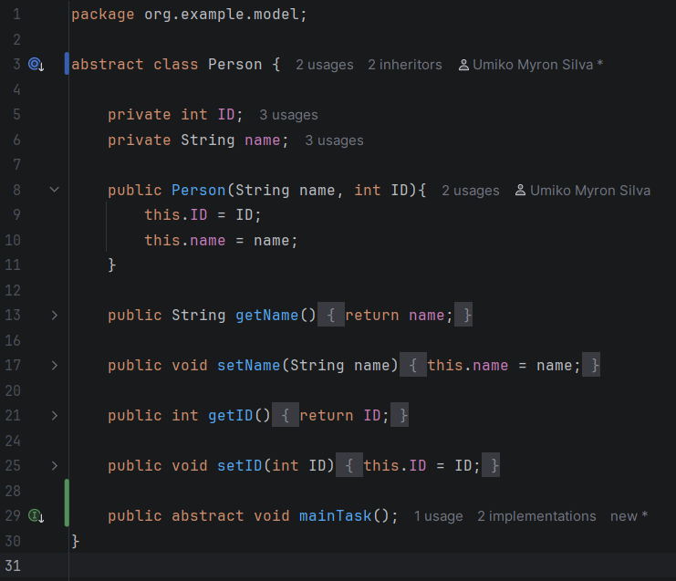
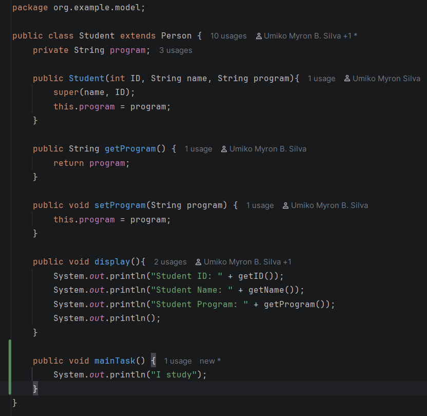
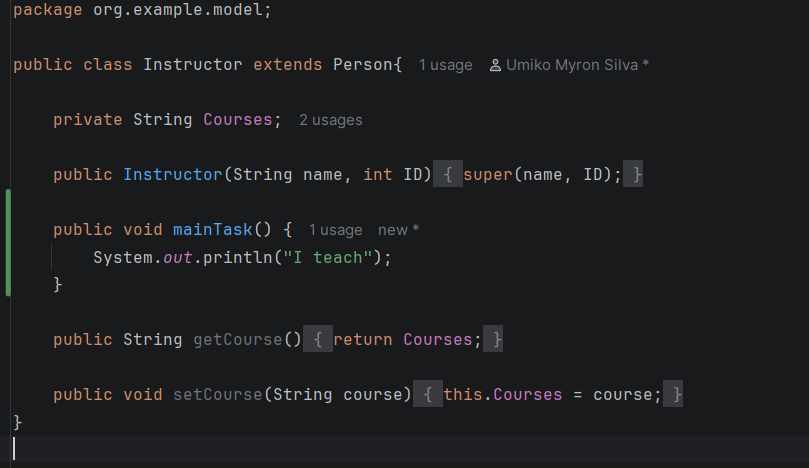
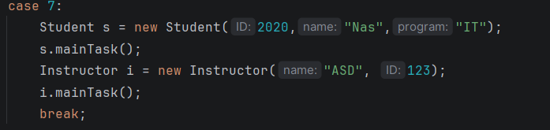

# Enrollment System

---
**Author**: Umiko Silva

**1. Output of simple enrollment system using setters and getters**

---
# Inheritance

---

**1. Screenshot (Proof of Inheritance)**

---
# Abstract Classes

---
**1. Changed Person into an Abstract Class**

// Instructor is not yet implemented.
