# Enrollment System

---
**Author**: Umiko Si
lva

**1. Output of simple enrollment system using setters and getters**

---
# Inheritance

---

**1. Screenshot (Proof of Inheritance)**

---
# Abstract Classes

---
**1. Changed Person into an Abstract Class**

---
# Interface

---
**Made Interfaces and made use of CampusRegistrar**

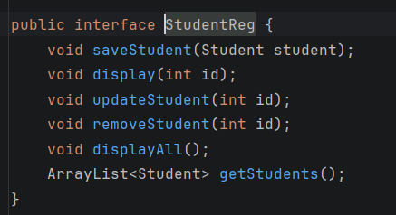

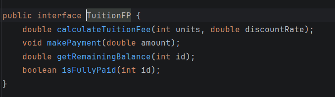

---
# Section

---
**Made Section and fixed the models**

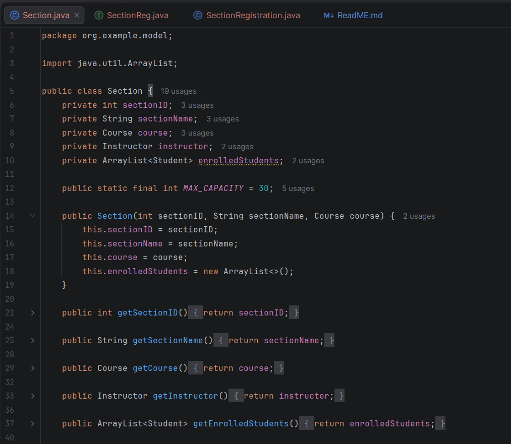

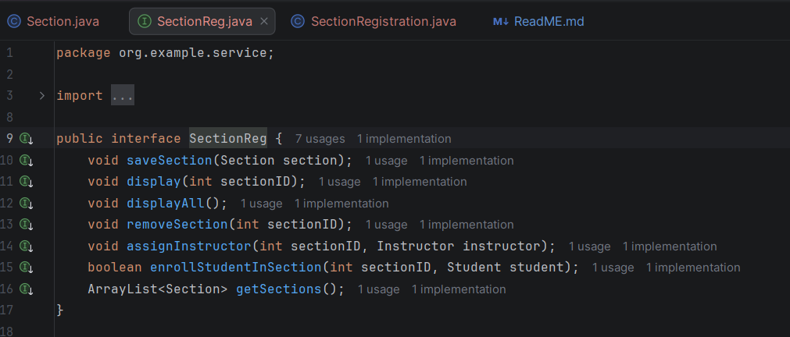

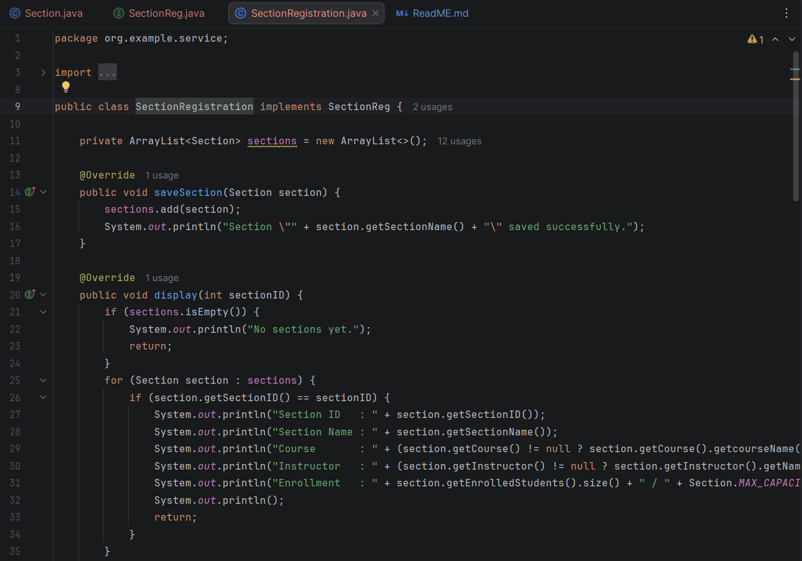

---
# Department

---
**Made Department and Hierarchy**

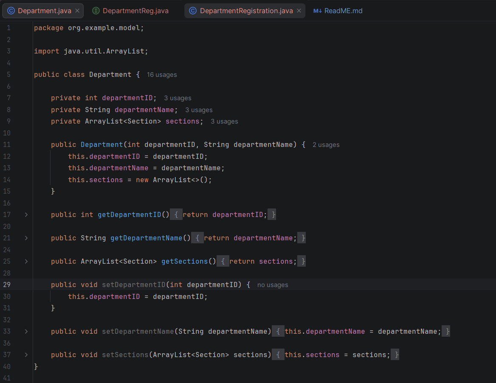

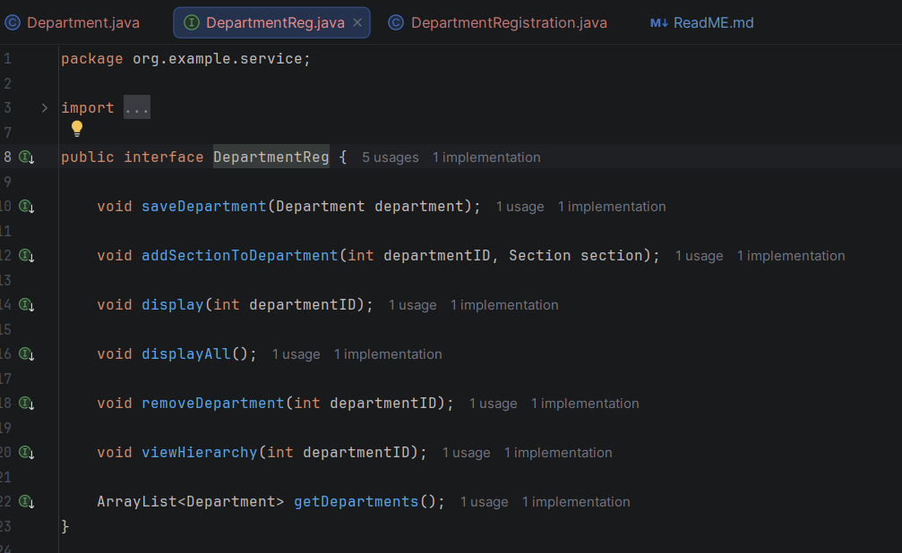

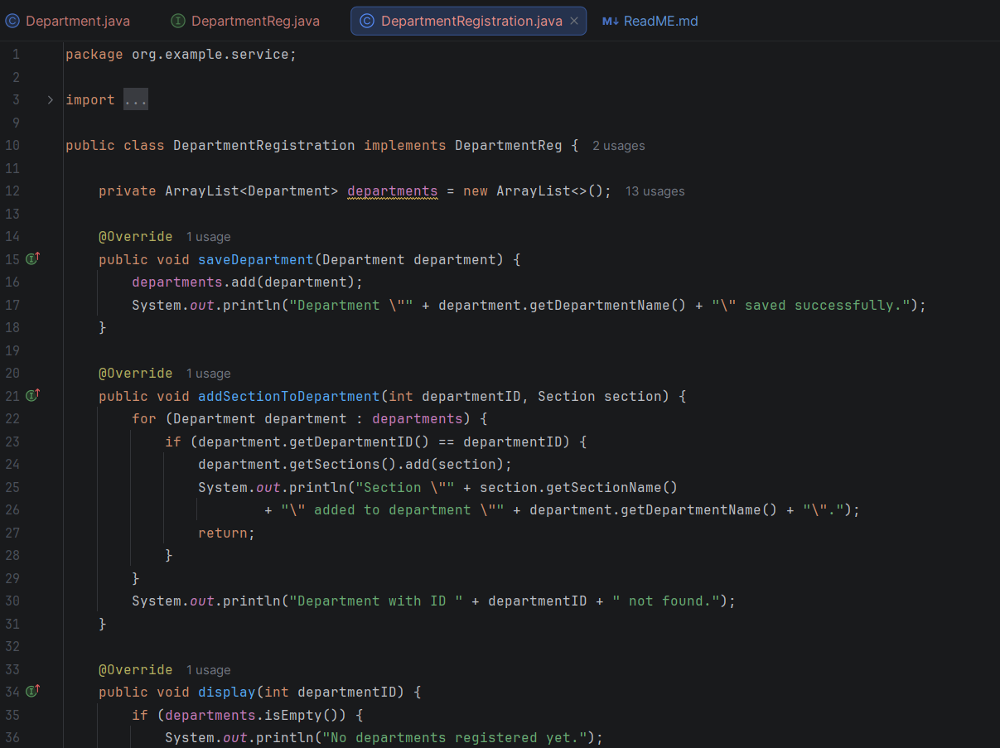

---
# Custom Exceptions and TryCatch

---
**Created custom exceptions and implemented try catches**

Sample Custom Exceptions

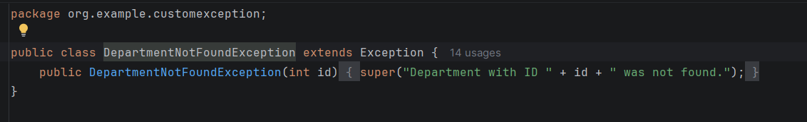

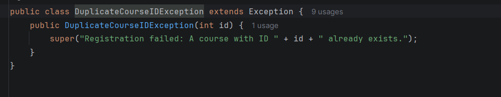

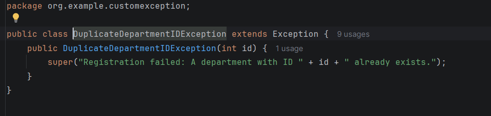